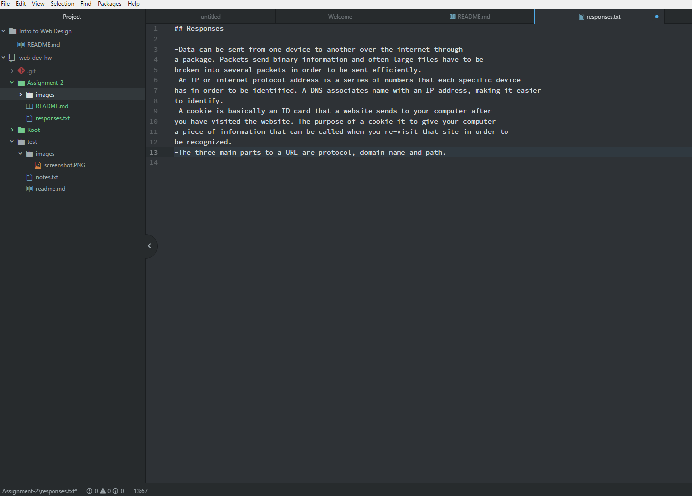

# Assignent 2

**Version control** is a type of system that keeps a file and a record of it's changes. This is helpful if you ever need to go back and look at information about the file at a specific time of development. Version control is also a great tool for projects that require collaboration between many people.
We're using version control in this class as a reference systems for our projects so we can go back and see what we have done,
when and why we have done that.

please read my [responses](./responses.txt) regarding internet protocols and systems.

-This week I learned the basics of the internet and how it works, file storage, the basics of Github and how to make links within a package.
-One issue that I had was making the link for my response page. I first tried to build it by writing "please read my [responses]regarding internet protocol and systems" with the file path
after that. After several tries I could not see the link on my page, I realized that I needed to put the file path directly after "[response]" and then follow it by "regarding internet protocol systems" in order to put my link in the desired place.

