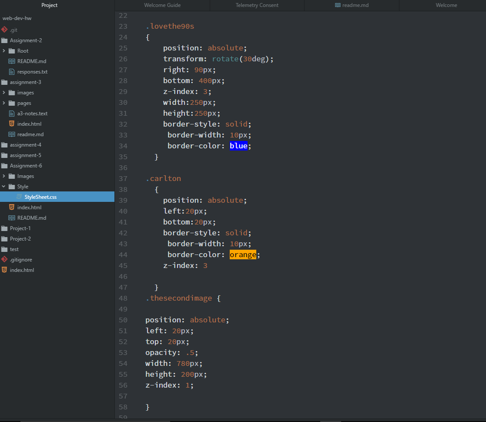

# Assignent 6

**The 90s**
-For this assignment my design was relatively simple. I added a few
images that were provided, a GIF from the internet and some text. Instead of using
3 different backround colors, I decided to use a backround image. I did however use colors
as backrounds and borders for some text, images and the GIF. The colors that I chose to use
were red, blue, purple, orange and hotpink. I tried expressing the 90s by using bright colors and big text, I guess that works.
**Work Cycle**
-Using CSS this week proved to be more of a challenge than the previous assignments. I had to push a lot of files to my repository just to
 check if everything was working correctly. It took me a really long time to figure out how to set the webpage to 800px by 800px but I think, maybe, that
I figured it out.

