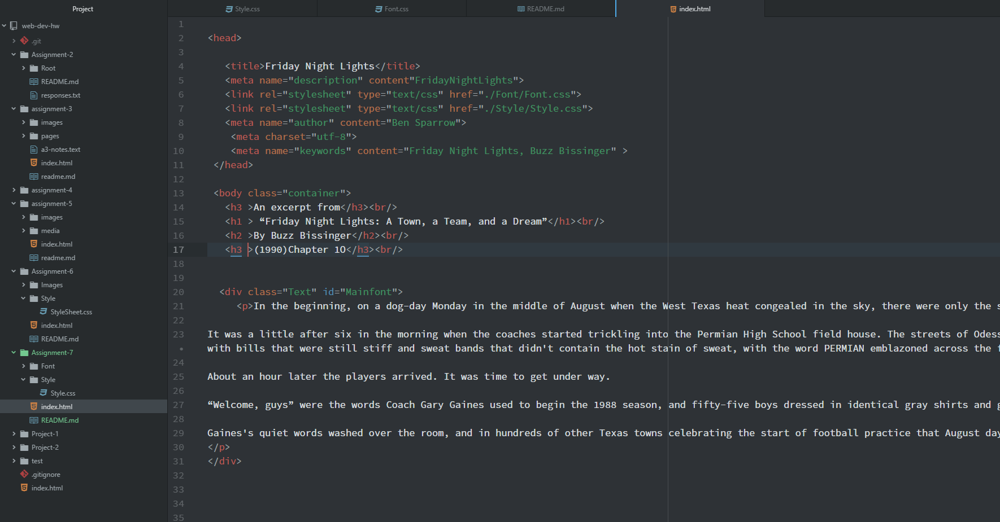

# Assignment 7

**Friday Night LIGHTS**
-For this assignment my design was simple. I decided to put the text inside of a container
with a yellow backround. I chose two fonts, Indie Flower and Gamja Flower, to style the text. Both texts
were found on Google Fonts and were linked and downloaded. System fonts are fonts that are already on your computer and are
ready to use. However, the issue with system fonts is that they may work on your computer, but might not work on a website. Web fonts are specific fonts that are provided by a server and are not required to be on a persons computer. Web-safe fonts are fonts that are able to be called upon with confidence of
availability. Fallback fonts in a font stack simply allow the browser to search for "fallback" fonts if the first font specified does not work. If
nothing works within the browser a default font that is specified is used.

**Work Cycle**
- This week went pretty smooth. I've been under the weather for a bit now, have fallen a bit behind, so I didn;t have the time to dive
as deep into this weeks topic as I would have liked. I'll definitely have to go back over the material in the coming weeks. I thought all the fonts
that are available on Google Fonts was pretty impressive and will come in handy.

