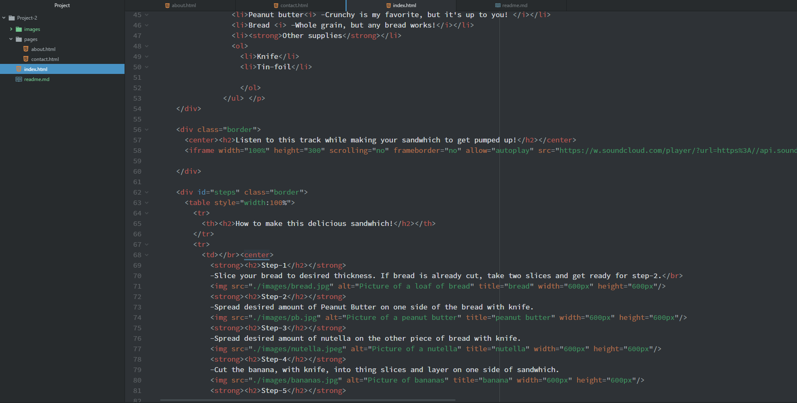

  # work flow for Project 2

  **HTML**
  -A few semesters back, I was enrolled in an Introductory Programming course that included some basic HTML. So far, most of the semester has been
  a review of previous things that I've learned. However, some of the topics discussed in the class went into a bit more detail. A few things that I learned this semester that I really found useful were "div's", the "ID" attribute and iframes.

   **CSS**
   -I'm excited to start the next section of this course. I have done some work with CSS, but am looking forward to gaining more knowledge!

   **This weeks work cycle**
   -This week, everything went pretty smooth! Like previous weeks assignments, I had a few issues with syntax, but I seem to be getting better at finding the issues and debugging them. I am definitely starting to feel more comfortable with HTML and how it works. I enjoyed this assignment and can't wait to learn more about styling a web page.

