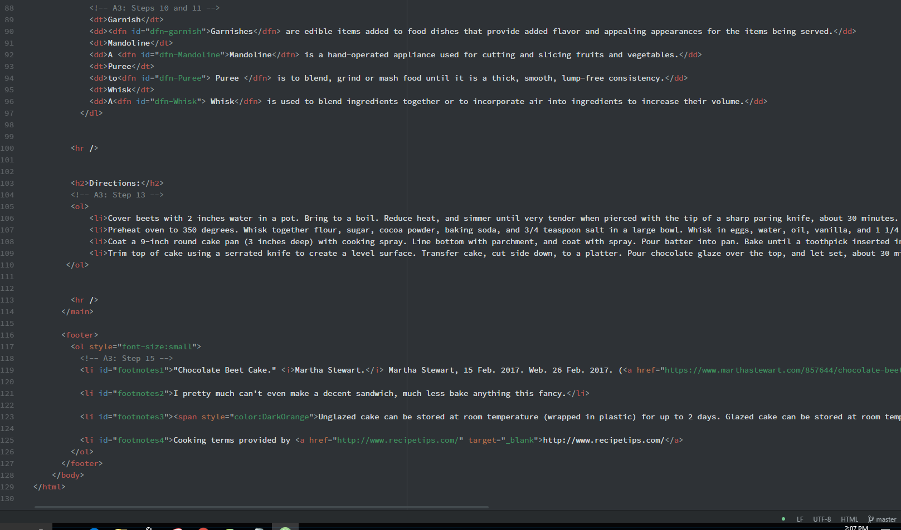

# workflow for assignment 3

-When creating a webpage using html, each page can have one opening and one closing tag for both the <head> and <body> and each can have many elements within.
 The <head> tag is placed between the <html> tag an the <body> tag and is resposible for giving metadata about your page. This metadata is not shown on the physical webpage
 itself, but is very useful for things like defining a title, styleing the page, setting keywords for browswers to use and so on. The <body> tags in a page hold all of the code that
 is used by the broswer to actually display to the user.

 -**Structural Markup+** is significant because as the name states it provides structural information about a document/webpage. Things such as headings, paragraphs, breaks and lists can all
 be characterized as structural Markup. **Semantic Markup** is significant because it can be used to put emphasis on singluar words or sentences. Editorial tools such as bold, italics, using quotes
 can all be characterized as Semantic Markup.

 This week was interesting because we were adding code to a website that was already built. It was vert helpful to see how the code was structured. I struggled a bit with linking the pages together,
 I thought I had the code right, but for whatever reason it would not allow me to go bewtween pages on the actual website. After about 30 minutes of trying to figure it out, the links started to work.
 There must of been a lag between GitHub processing the new code I uploaded because the codes syntax was fine, it just took time to start working. A bit frustrating, but now I know for the future I may need to give it a bit of time before testing to see if the code worked.

 
