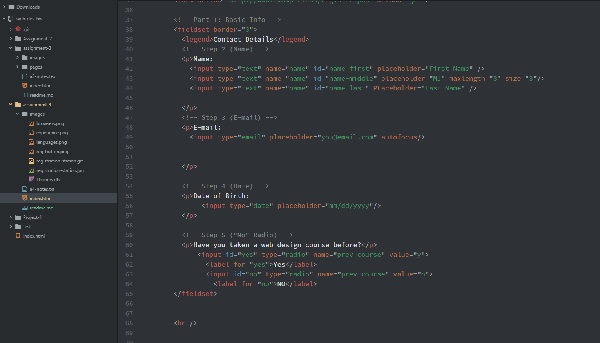

  # work flow for assignment3

  -**"Alt-Text"**- Alt-text can be described as an alternative text attribute, used to describe the image and by screen readers for the hearing impaired.

  -**Forms**-Being someone who uses the internet very often, I have come across all of the forms we discussed in this section. The most basic definition of a form is a space in a webpage, set up by developers, allowing them to collect information based on user input.

  **This weeks work cycle**
           This week the assignment was relatively straightforward. I learned about forms, figures and how to apply them to a webpage. I didn't have any issues this week! In past assignments i've had a few issues with syntax, but it seems that a little practice has gone a long way!
           It wasn't specified in the assignment, but I chose to nest a few extra fieldset elements within the previous experience fieldset. I did this because it was hard to tell where one set of questions started and the next stopped. This seemed to add a little more organization to the page.

           
