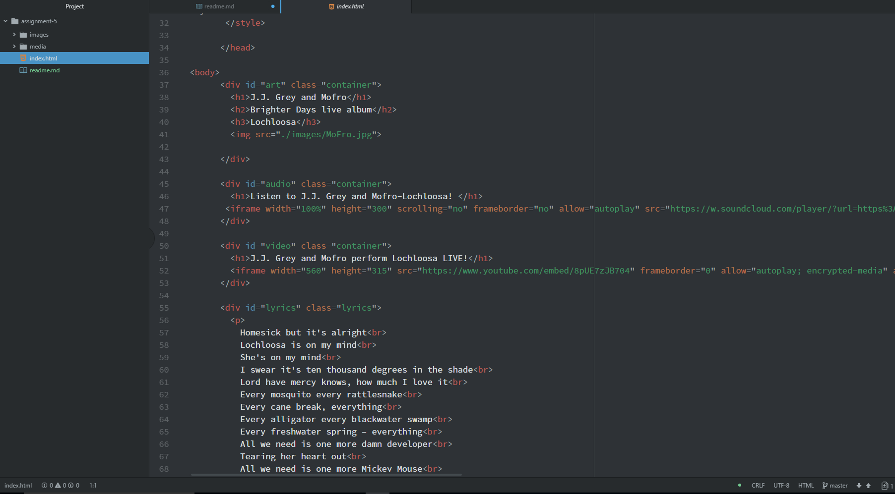

  # work flow for assignment5

  **divs, classes, ids, and spans**
   - divs are used to keep elements together adding organizational definition to a webpage within a specified area. Classes are used within elements,
   giving the ability for these elements to all be styled the same. Ids are strings added to elements in order to define specific identities or styling. The id should be different within each element. The span is similar to the div tag but can be used with inline styling to define specific text that needs to be styled.

   **first party vs. third party hosting**
   -One of the biggest benifits to third party hosting compared to first party hosting is the use of less bandwidth. Also, it's easier to embed code from a source, than write your own. lastly, the videos from a third party host tend to be of a higher quality.

   **This weeks work cycle**
   -This week took a little more time than previous assignments. Understanding and writing the code went well with the exception of a few issues. One issue that took a considerable amount of time was in realtion to syntax, again. I thought my code was right, and after several attemps to change things and push to GitHub, I was still having issues. I finally realized that my code was missing one greater than > sign to end an element. This one missing piece threw off my whole code. It was a challenge to find the issue, but it's part of the learning process, and now I know one more thing I have check in the future.

